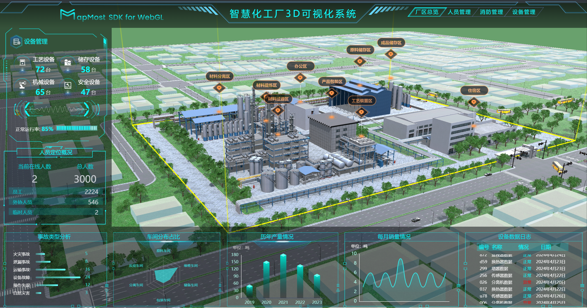
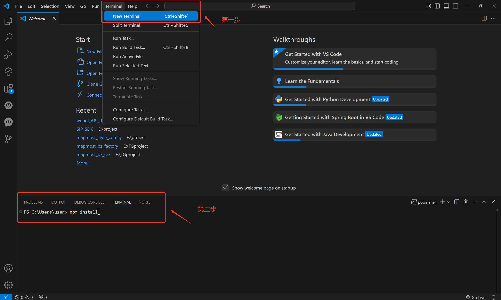

# 简介

本项目是基于 [Mapmost SDK for WebGL](https://www.mapmost.com/#/layout/webgl/home/) 实现的一个数字孪生智慧化工厂案例，旨在助力厂区智能监控与安全管理。


>)

### 案例效果

[☞ 在线预览](https://www.bilibili.com/video/BV1cH4y1g7nr/)

[☞ 在线体验](https://delivery.mapmost.com/cdn/factory/dist/index.html)



### 案例功能

#### 1、厂区总览
- 提供实时准确的厂区布局，助力高效安全的厂区作业。
- 通过飞行漫游，可查看厂区各区域的主要功能。

#### 2、人员管理
- 人员定位：可实时监控人员位置并查看人员信息，全面掌控员工工作状态。
- 人员巡检：可沉浸式进行设备巡检，实时追踪巡检路径。
- 巡检轨迹：可自定义规划厂区巡检路径。
- 非法闯入：可快速响应安全事件，确保生产现场的安全。

#### 3、消防管理
- 火灾报警：可智能识别预警火灾风险，可视化展示火灾区域。
- 消防设备：可实时查看消防设备的位置并检查设备状态。
- 逃生/救援路径：根据火灾报警区域，可快速规划救援与逃生路径。

#### 4、设备管理
- 重点设备：可全面监控重点设备，实时捕捉设备运行状态。
- 监控视频：可接入监控数据，随时调取查看监控画面。
- 温度传感：可接入loT数据，以热力图的形式展示厂区温度状态。
- 管道可视：可实时查看厂区管道的流向效果。

### 项目运行

> 运行前请确保已经安装以下环境

- node.js (http://www.nodejs.com.cn/)

  #### 安装

  - 以 VS Code 为例，打开工程文件夹，点击 终端（Terminal） -> 新建终端（New Terminal），并在终端中输入“npm install”命令后回车即可。
  
  ```
  npm install
  ```
  
  

  #### 修改授权码

  > 运行前请确保已经免费获取 SDK 授权码

  - [☞ 点击免费申请](https://www.mapmost.com/#/productApply/webgl/?source_inviter=nqLdqFJp)
  - 在`src\components\Map.vue`文件中找到如下代码，将`userId`替换为您获取的授权码。
    ```js
    // 地图初始化
    let map = new mapmost.Map({
      container: 'map-container',
      name: 'ditu',
      style: style_opacity,
      doubleClickZoom: false,
      center: [120.7290563605585, 31.288141509716326],
      zoom: 18.542327120640703,
      sky: 'light',
      pitch: 62.478852920710885,
      bearing: 90.88015604663417,
      userId: '***', // 请输入您获取的授权码
      env3D: {
        defaultLights: false,
        envMap: './assets/data/yun(13).hdr',
        exposure: 2.53,
      },
    });
    ```

  #### 运行
  用于启动并运行应用程序，以便开发人员在本地进行开发和测试。
  - 运行命令：
  ```
  npm run dev
  ```

  #### 打包
  用于构建和打包你的应用程序，使其准备好在生产环境中部署。
  - 运行命令：
  ```
  npm run build
  ```

  ### 工程列表
  ``` shell
  digital-twin-factory/
  │
  ├── public/                     # 公共文件，不会被Webpack处理
  │   ├── assets                  # 静态资源，如模型、图片等
  │   └── libs                    # 引用文件
  │
  ├── src/                        # 源代码目录
  │   ├── api/                    # 地图场景控制
  │   │   ├── CarApi.js           # 车辆移动控制
  │   │   ├── MapApi.js           # 地图场景设置
  │   │   └── SceneApi.js         # 场景环境设置
  │   │
  │   ├── assets/                 # 静态资源，如图片等
  │   │   └── images/
  │   │
  │   ├── components/             # 公共组件
  │   │   └── Map.vue
  │   │
  │   ├── layout/                 # 页面文件
  │   │   ├── LyBottom.vue
  │   │   ├── LyLeft.vue
  │   │   ├── LyLeftBottom.vue
  │   │   └── LyTop.vue
  │   │
  │   ├── App.vue                 # 主组件
  │   ├── main.js                 # 入口文件，用于创建Vue实例
  │   └── style.css               # 样式文件
  │
  ├── .gitignore                  # Git忽略文件配置
  ├── .npmrc                      # npm安装包源配置
  ├── index.html                  # 主页HTML模板
  ├── package.json                # 项目依赖和配置信息
  ├── package-lock.json           # 依赖锁定文件
  ├── README.md                   # 项目说明文档
  └── vite.config.js              # Vue项目自定义配置
  ```

### 核心依赖

- Mapmost SDK for WebGL [https://www.mapmost.com/mapmost_docs/webgl/latest/](https://www.mapmost.com/mapmost_docs/webgl/latest/?source_inviter=nqLdqFJp)

### 核心能力
Mapmost SDK for WebGL 提供数据、服务、可视化、分析等7大类能力，该案例主要涉及以下功能：
- 1、模型加载
- 2、视角切换
- 3、三维标签
- 4、模型高亮
- 5、火焰效果
- 6、地理围栏
- 7、三维特效圆
- 8、三维特效线
- 9、三维热力图
- 10、后期泛光效果
- 11、实时视频文件接入

### 更多参考

Mapmost [https://www.mapmost.com/#/](https://www.mapmost.com/#/?source_inviter=nqLdqFJp).


